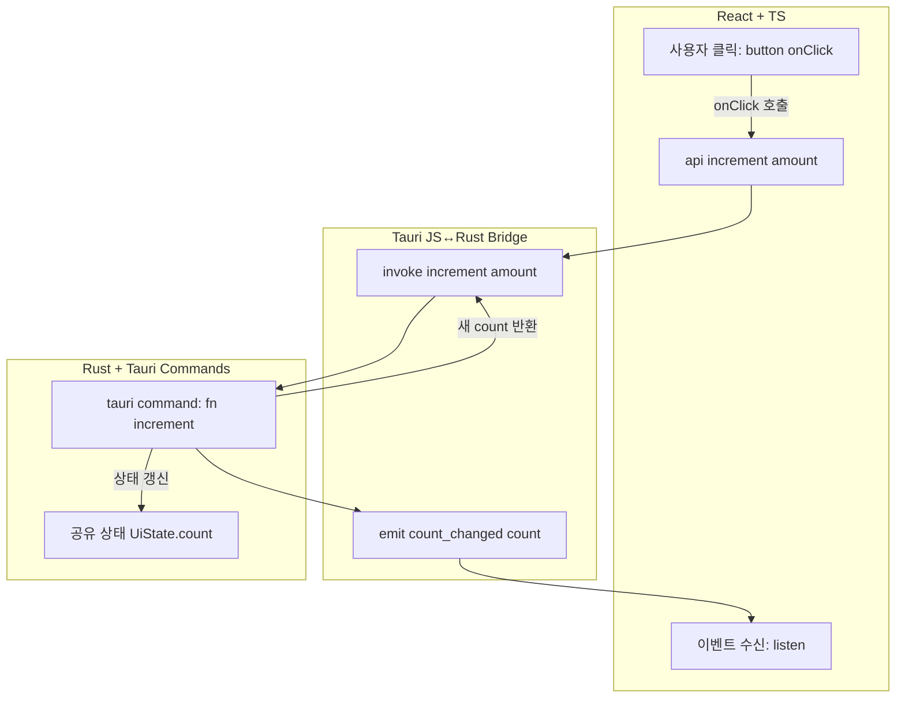

```mermaid
graph TD
    subgraph Frontend[React + TS]
        Btn[사용자 클릭: button onClick]
        API[api increment amount]
        Listen[이벤트 수신: listen]
    end

    subgraph TauriBridge[Tauri JS↔Rust Bridge]
        Invoke[invoke increment amount]
        EmitEvent[emit count_changed count]
    end

    subgraph Backend[Rust + Tauri Commands]
        CmdIncrement[tauri command: fn increment]
        State[공유 상태 UiState.count]
    end

    Btn -->|onClick 호출| API
    API --> Invoke
    Invoke --> CmdIncrement
    CmdIncrement -->|상태 갱신| State
    CmdIncrement -->|새 count 반환| Invoke
    CmdIncrement --> EmitEvent
    EmitEvent --> Listen

```
