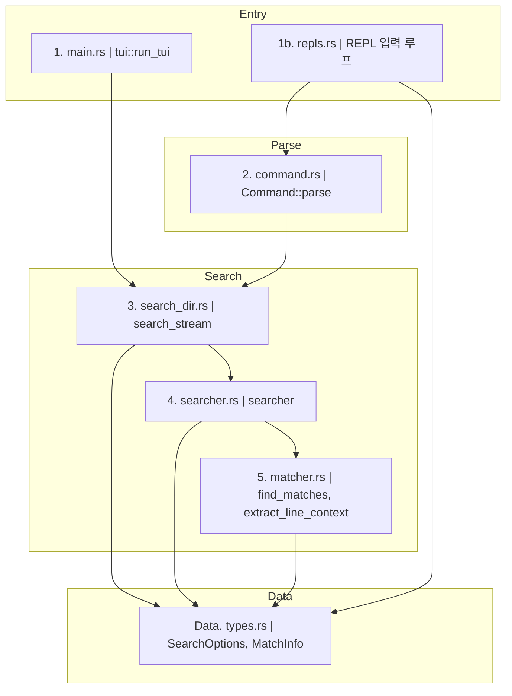

# search-core 구조 요약

## 흐름 요약
- TUI 모드: `main.rs`에서 `tui::run_tui()` 시작
- REPL 모드: `repls::run_repl()`이 입력을 받아 `Command::parse`로 해석
- 검색 파이프라인: `search_stream`(디렉토리 순회) -> `searcher`(파일 검색) -> `matcher`(바이트 매칭)
- 결과 타입: `MatchInfo`, `SearchOptions`는 `types.rs`
