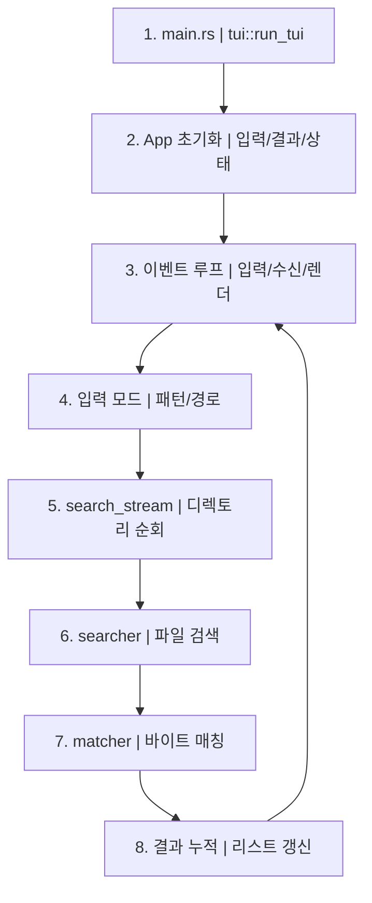

# search-core TUI 모드 정리

## 개요
- search-core는 검색 파이프라인과 TUI/REPL 실행부로 구성
- TUI 모드는 `main.rs`에서 `tui::run_tui()`로 진입
- 검색 파이프라인은 `search_dir::search_stream` -> `searcher::searcher` -> `matcher`로 흐름

## TUI 모드 실행 흐름
- 진입: `src/main.rs` -> `src/tui.rs#run_tui`
- 초기화: 터미널 raw mode + alternate screen 설정
- 상태: `App`이 결과 목록, 입력 모드, 검색 상태, 스크롤 상태 보관
- 이벤트 루프:
  - 입력 이벤트 처리 (일반 모드/입력 모드 분기)
  - 검색 결과 수신 (mpsc receiver try_recv)
  - UI 렌더링 (검색 입력, 결과 목록, 상태바)
- 검색 시작:
  - 입력 모드에서 Enter -> `start_search` 호출
  - `search_stream` 결과를 백그라운드 task가 mpsc 채널로 전달
  - 루프에서 논블로킹으로 결과를 받아 `App`에 누적

## Mermaid 흐름도 (세로)

## 좋은 구조 설계 제안
- 상태와 렌더링 분리:
  - `AppState`(데이터)와 `Ui`(렌더)로 분리하면 테스트 용이
- 입력 처리와 도메인 로직 분리:
  - 키 입력 파싱은 `InputHandler`, 검색 실행은 `SearchService`
- REPL/TUI 공통 파이프라인화:
  - `Command` 파서와 `search_stream` 호출을 공유 레이어로 추출
- 에러 처리 흐름 명확화:
  - 사용자 메시지와 내부 에러를 분리해 표시

## 기존 구조 평가 및 개선점
- `src/tui.rs`에 상태/입력/렌더/검색 실행이 모두 섞여 결합도 높음
  - 개선: 상태, 이벤트 처리, 검색 서비스로 분할
- `SearchOptions`가 실제 옵션 UI와 연결되지 않음
  - 개선: 옵션 토글 키 추가 또는 설정 로딩
- TUI/REPL이 같은 검색 파이프라인을 쓰지만 입력 파싱은 중복
  - 개선: 공통 Command 처리 계층 도입

## Rust 문법/개념 포인트
- `Arc`:
  - 여러 스레드에서 공유되는 검색 패턴을 안전하게 공유
  - `Arc::clone`은 얕은 복사 (레퍼런스 카운트 증가)
- `spawn_blocking`:
  - CPU/IO 묶음 작업(디렉토리 워크)을 비동기 런타임에서 분리
- `mpsc` 채널:
  - 백그라운드 검색 결과를 UI 루프로 전달
- `StreamExt::next`:
  - 스트림에서 비동기적으로 다음 값을 가져옴
- `Result`와 `?`:
  - 에러 전파를 간결하게 처리
- `derive`:
  - `Debug`, `Clone`, `Default` 등을 자동 구현해 사용성 향상

## 참고 경로
- `src/main.rs`
- `src/tui.rs`
- `src/search_dir.rs`
- `src/searcher.rs`
- `src/matcher.rs`
- `src/types.rs`
