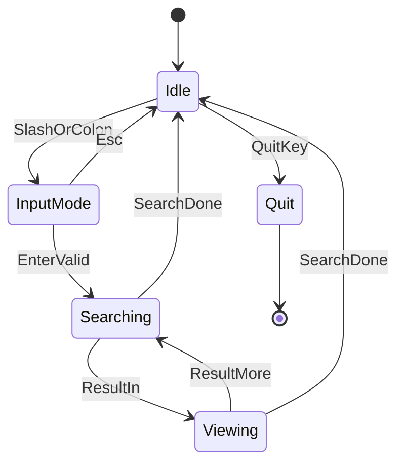

# search-core TUI 상태 전이 다이어그램

## Mermaid 상태 전이

## 키 설명 (한글)
- SlashOrColon: `/` 또는 `:` 입력
- Esc: 입력 모드 취소
- EnterValid: 패턴이 비어있지 않을 때 Enter
- ResultIn: 검색 결과 수신 시작
- ResultMore: 추가 결과 수신
- SearchDone: 검색 종료(채널 종료)
- QuitKey: `q` 또는 `Ctrl+Q`
